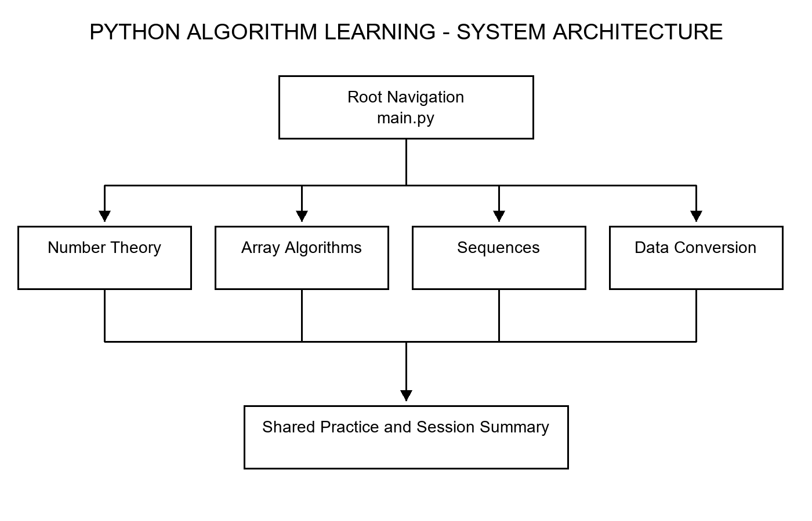
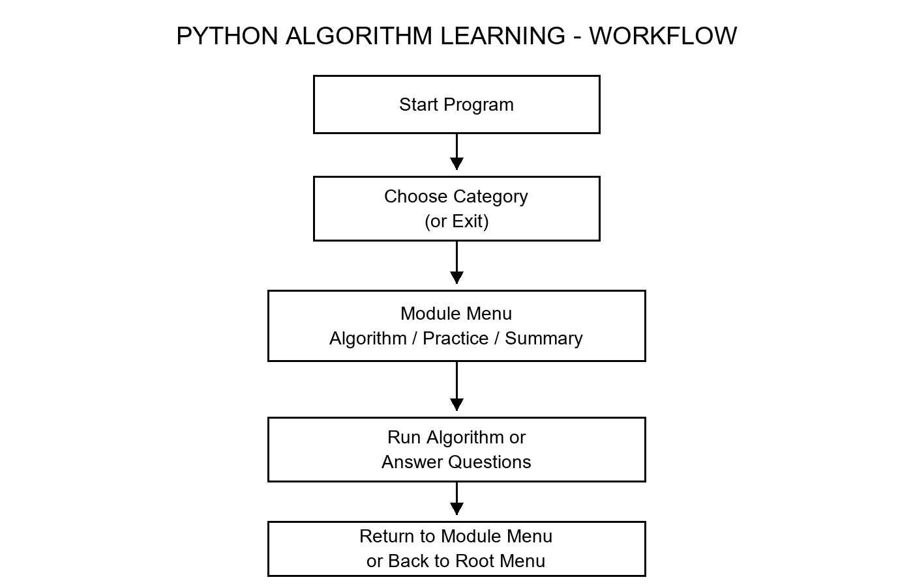

# Python Algorithm Learning - Technical Documentation

## Problem statement

Learners need a small, interactive way to run introductory algorithms and practise understanding their results.

## Project objectives

- Group common algorithms into four clear categories.
- Validate normal user input and return to the root menu without restarting.
- Provide simple randomized practice and session-only performance tracking.

## Modules

- **Number Theory:** GCD, prime check, prime factorization, and LCM.
- **Array Algorithms:** reversal, occurrence count, kth smallest, linear search, and bubble sort.
- **Sequences:** Fibonacci values, factorial, and whitespace-separated string conversion to integers.
- **Data Conversion:** non-negative decimal to hexadecimal and binary to decimal.
- **Practice:** topic and mixed question sets, randomized selection, answer checking, and in-memory statistics.

## Main menu structure

The root menu contains Number Theory, Array Algorithms, Sequences, Data Conversion, and Exit. Each module has its own algorithm menu, topic practice, mixed practice, performance summary, and a 0 Back to Main Menu option.

## Module interaction

The root main.py launches a selected module's main.py as a child Python process. A module returns when its user selects 0, after which the root menu continues. The four module menus use the shared root practice.py for practice and session statistics.

## System architecture

## Workflow

## Data and limits

The program does not write learner data to disk. Practice performance exists only while a module process is running. This version is a terminal application and has no online resource search.

## Screenshot note

The available computer-use environment exposed no desktop apps or browser, so genuine full-screen application screenshots could not be captured in this run. Supplementary test output is in screenshots/TEST_OUTPUT.txt.
